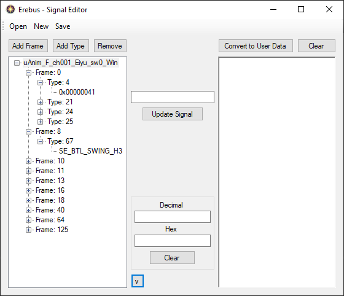

# Erebus Signal Editor

Erebus is a signal editor of FE Fates that can read and generate signal data for animations. Supports reading signals right from the bch or raw signal data extract.
also allows saving the signals as raw binary data or viewing that raw data in text format.
 
### Usage
Open - opens a bch or signal file. 
New - Generate new signal data from scratch. 
Save - Save the current data to a binary file. 
 
Add Frame - Adds a new frame to the current signal tree, input number. 
Add Type - Adds a signal type to the selected frame, input number. 
Remove - Removes the selected Frame or Signal.

Update Signal- Used to update the selected data with the data in the input text box.

Convert to User Data - Converts the current Signal Tree to raw Signal Data as viewable text.<br\>
Clear - Clears the Text box of all data

Bottom Arrow - Opens a basic Decimal <-> Hex converter for easy editing.

### Credits
[FEIF_Arc](https://github.com/GovanifY/FEIF_ARC) for GY_BinaryStream.cs